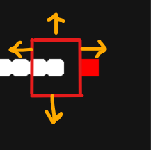

# Snake-Reinforcement-Learning

  

The snake game: 2 modes - Manual and AI

Global Variables in Snake_Game.py:
```
Manual = Change between different modes (Manual/AI)
width = Width of the board
height = Height of the board
speed = Speed of the game
```
The AI is trained using Reinforcement Learning: Q-Learning Algorithm. This stores values of each state-action pair in a Q-table.  `Q_table_3000.txt` stores the Q-table after 3000 iterations of training. You can use these values to see quick results or you can let your snake train on your own. By default it uses these values. 

### States:
- All 9 cells: If something is present in this cell: 1, else: 0
    Eg. This state will have an bits: 000 110 000



- Position of the food with respect to Snake's head - represented by 4 bits: 
	Left		Up		Right	Down
	0			0			0			0
	This represents if the food is present on this position, then this bit is set to 1 else 0
    Eg. This state will have bits: 0010
- This makes a total of 9+4 bits = 13 bits. So we are storing it in an integer.
- `getState()` function in `Snake_Machine.py` gives us the current state 

### Rewards:
- Every step will give a 0 reward
- +1 for food eaten
- -10 for game over
- To avoid loops, every episode will end in 1000 steps

### Final Output

